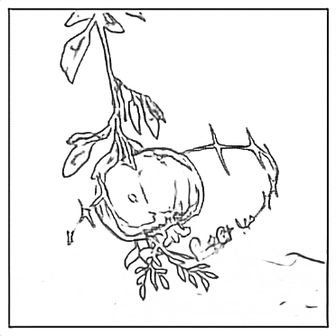
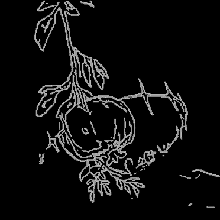
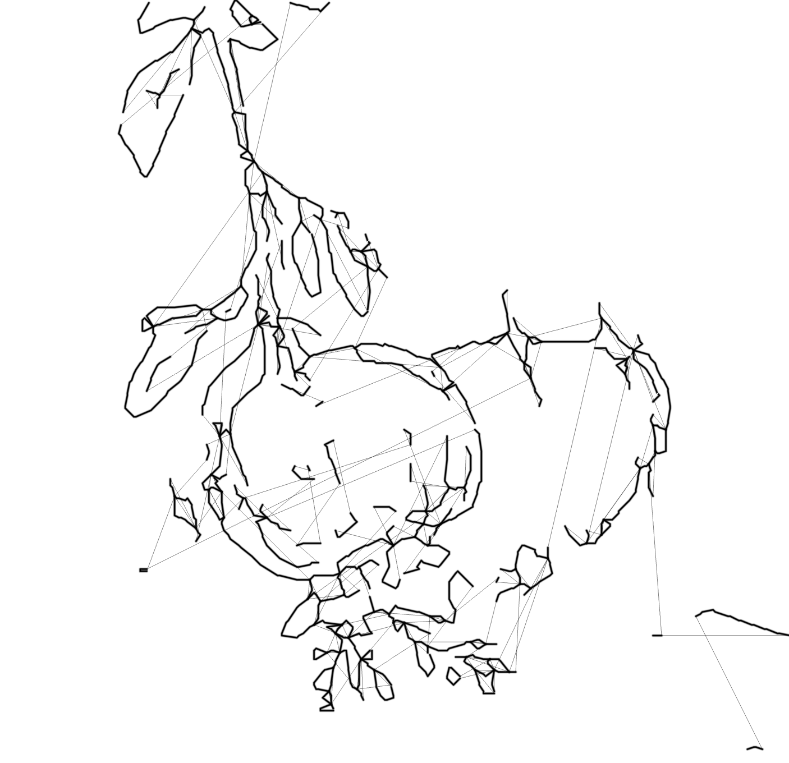
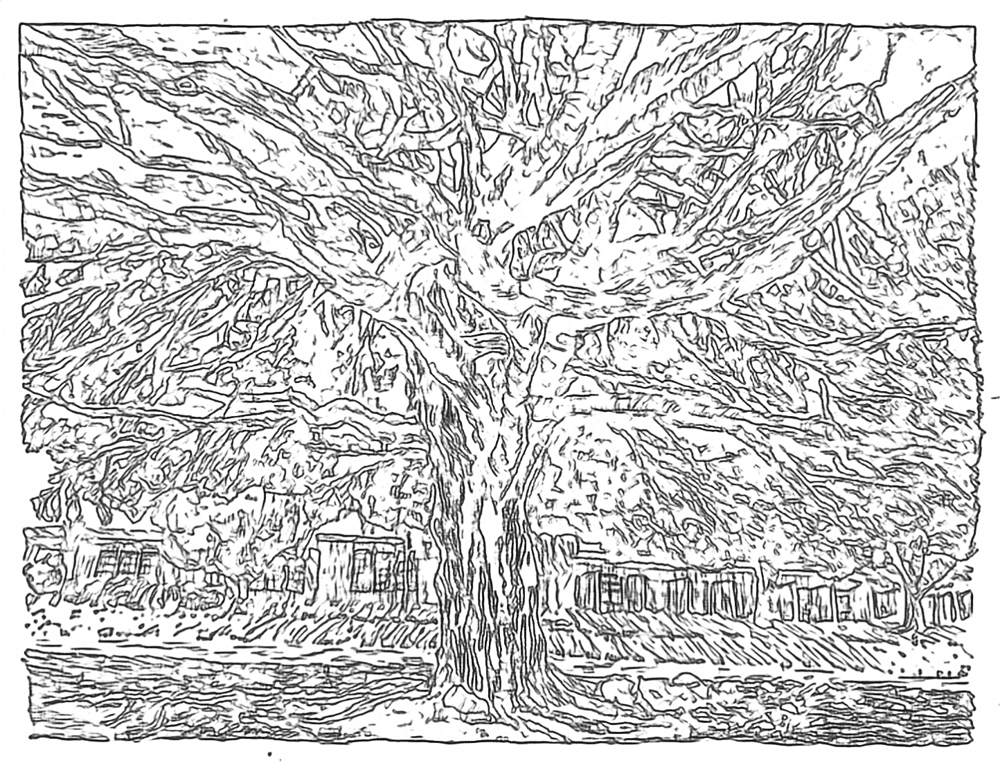

# literate-doodle
"Great repository names are short and memorable. How about literate-doodle?" Thanks github for the coincidentally amazing title!

## What
This project turns pictures into illustrations drawn by a fourier transform epicycles machine.

[pomegranate image] [demo video here]
[demo link here]

## Inspiration
[desmosit lol]

## PROCESS

Here's an overview of the process:
1. Find a picture
2. Blur the image (gaussian blur)
3. Use [TEED](https://github.com/xavysp/TEED) algorithm for edge detection
4. Prep for skeleton tracing by turning image into binary #000000 and #FFFFFF values
5. Used [Lingdong's skeleton trace tool](https://github.com/LingDong-/skeleton-tracing/tree/master) to get the svgs for the line art
6. Used [vpype](https://vpype.readthedocs.io/en/latest/#) to optimize pen plotter pathway.
7. Turn svg into coordinates with [svg-parser.js](https://github.com/qwistaycat/literate-doodle/blob/main/fourier/svg-parser.js)
8. Used the Coding Train's fourier transform scripts to turn the plots into fourier epicycles and then sketch it.

---
# Here's a step by step example of this process:

My original image is this painting:

I processed it in TEED for edge detection, which then looked like this:

### ***a pain point***
I originally had struggles converting to an svg from this png because I naively thought using any online converter would work. However, some produced artifacts, and others would outline the outline, double counting the paths I need. In order to get the correct result, I used a skeleton tracing tool to get this result:

Before that, I had to process the image to be purely binary colors with black and white to feed into the tracer:

Now that I have the svg, I wanted to optimize the path in which the lines would draw. Here is a visual of the path (including pen-up traces) originally:

With vpype processing the paths are clearly much cleaner:

Now following the algorithm for fourier transform epicycles ([fourier.js](https://github.com/qwistaycat/literate-doodle/blob/main/fourier/fourier.js)), we draw it ([sketch.js](https://github.com/qwistaycat/literate-doodle/blob/main/fourier/sketch.js)) and it produces the final result!

[insert video here]

# Further Exploration
I was curious to see just how far I can take it so I tried to use this really complex ink pen drawing of a tree...

... and it was successful during TEED edge detection and skeletonization...

but upon converting to coordinates for the epicycles, it completely crashed, probably due to too many points.

# Final Demo

I tried for another image with complexity in between the pomegranate and the tree, and here's the final result!

[https://youtu.be/2OK_SXe4AyY?si=oFhNePGlt-rYSGb2
](https://youtu.be/2OK_SXe4AyY?si=oFhNePGlt-rYSGb2)

## Acknowledgements

Got through with a lot of Claude Code Opus 4.6 and coffee.
Golan really helped me find the overall strategy for this workflow and pointers to all the resources I used, and Leslie showed me the resource for [Prepping SVGs for Plotting with vpype](https://github.com/golanlevin/DrawingWithMachines/blob/main/generating_svg/vpype_svg_prep/README.md#prepping-svgs-for-plotting-with-vpype).
